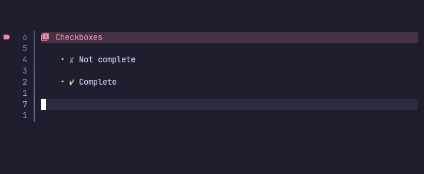

# Checkboxes



## Configuration options

The `checkboxes` option has these sub-options.

```lua
checkboxes = {
    enable = true,

    checked = {},
    unchecked = {},
    pending = {}
}
```

### Global options

The `checkboxes` option comes with the following `sub-options` that affect all the different states of the checkbox.

> enable
> `boolean or nil`

When set to `false`, checkboxes are not rendered.

### State options

A checkbox can have various states and the states can be individually configured.

Currently supported states are.

- checked,
  When the checkbox is marked/checked this option is used to render it.

- unchecked,
  When the checkbox is unmarked/unchecked this option is used to render it.

- pending,
  When the checkbox is marked/checked as pending(using `[-]`) this option is used to render it.

### State configuration options

Each states can have the following sub-options.

> text
> `string`

The text to show for the checkbox.

> hl
> `string or nil`

Highlight group for `text`.

## Gallery

Wow, so empty 😐

