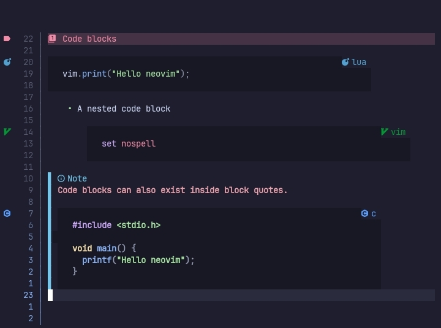

# Code blocks



## Configuration options

The `code_blocks` option comes with these sub-options.

```lua
code_blocks = {
    enable = true,
    style = "language",
    position = "overlay",

    hl = "markdownCodeBlock",

    min_width = 70,
    pad_char = " ",
    pad_amount = 2,

    language_names = nil,
    name_hl = nil,
    language_direction = "right",

    sign = true,
    sign_hl = nil
}
```

## Options

> enable
> `boolean or nil`

When set to `false`, code blocks are not rendered.

> style
> `string`

Name of the style to use. Currently available styles are.

- simple,
  Adds a simple background to the lines of the code block.

- minimal,
  Creates a box around the code block(like shown in the browser).

- language,
  Like `minimal`, but also shows language file icon, language name & signs.

>[!NOTE]
> The `style` changes what options are available.

> hl
> `string or nil`

Name of the highlight group to use as the background of the code block.

---

> min_width
> `number or nil`
>
> For `language` & `minimal` styles only.

Minimum width of the code blocks without the paddings. Default is 60.

> pad_char
> `string or nil`
>
> For `language` & `minimal` styles only.

Character to use as the padding of the code block.

> pad_amount
> `number or nil`

Number of character to add as padding.

---

> language_names
> `{ string, string }[] or nil`
>
> For `language` style only.

List of tuples containing a **match** and a **replacement**. They are only applied if they text in the code block is the same as the match.

Here's a small example to show why this exists.

```lua
language_names = {
    { "py", "python" },
    { "cpp", "c++" }
}
```

Normally you need to use `py` for *python* code blocks. With this you can make it say `python` instead of `py`.

> name_hl
> `string or nil`
>
> For `language` style only.

Highlight group for the language name. When nil the highlight group of the icon is used.

> language_direction
> `string or nil`
>
> For `language` style only.

When set to `left` the language name & icon are shown on the top left of the code block. When set to `right`, it is placed on the top right corner instead.

> position
> `string or nil`
>
> For `language` & `minimal` styles only.

Changes the `virt_text_pos` of the top & bottom border. Default is `inline`.

Possible values are explained in the `nvim_buf_set_extmark()` help file.

---

> sign
> `boolean or nil`
>
> For `language` style only.

When set to `true`, the file icon of that language is shown in the **sign column** on the line a code block starts.

> sign_hl
>
> For `language` style only.

Name of the highlight group for `sign`. By default the icon's highlight group is used.

## Gallery

Wow, so empty 😐

