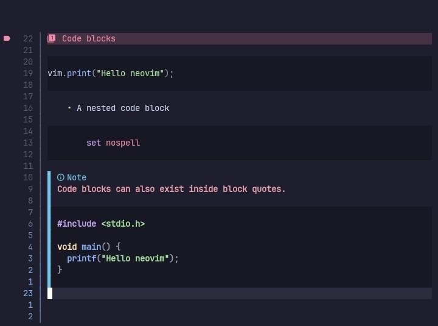
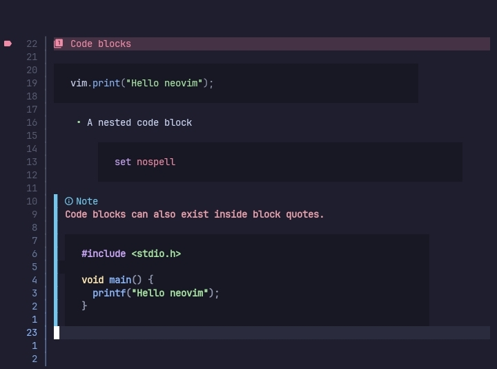

# Code blocks


This plugin provides custom `code blocks` that can be configured via the `code_blocks` option.

## Configuration

The configuration table for `code blocks` is given below.

```lua
code_blocks = {
    enable = true,
    style = "language",

    hl = nil,

    language_direction = "right",
    language_names = {},
    name_hl = nil,

    min_width = 70,
    pad_amount = 2,
    pad_char = " ",

    position = "overlay",

    sign = true,
    sign_hl = nil
}
```

### enable

A boolean, enables/disables custom `code blocks`.

### style

A string, name of the style to use.

Currently available styles are,

- simple, Adds a background color to the code blocks.
- minimal, Adds padding to the code block and better background.
- language, Shows language name, signs and better code block highlighting.

#### Style: simple



Adds a simple background to the code blocks.

```lua
code_blocks = {
    style = "simple",
    hl = "dark"
}
```

##### hl

The highlight group for the background.

#### Style: minimal



Adds GitHub-like background to the code blocks.

```lua
code_blocks = {
    style = "minimal",
    position = "inline",

    pad_char = " ",
    pad_amount = 2,

    hl = "dark",
    min_width = 70
}
```

> Properties not mentioned are already explained.

##### min_width

The minimum width for the code block. If the block is longer than the value then the longest line is used.

>[!NOTE]
> This is without the paddings.

##### pad_char

Text to use as padding for the code block.

##### pad_amount

The number of `pad_char` to add before & after the lines in the code block. Default is 1.

##### position

Changes the `virt_text_pos` for the top & bottom borders. Default is `inline`.

#### Style: language


Shows the language strings of the code blocks. Additionally supports icons.

```lua
code_blocks = {
    style = "language",
    position = "overlay",

    min_width = 60,
    pad_amount = 3,

    language_names = {
        { "cpp", "c++" },
        { "py", "python" }
    },

    sign = true, sign_hl = nil
}
```

> Properties not mentioned are already explained.

##### language_direction

Changes the position where the language name & icons are shown.

Available values are,

- left
- right(default)

##### language_names

A list of `tuples` where the first value is the string to match and the second value is the string to display.

You can use this for languages like `C++` & `python` where the language name is different than what is written in the code blocks.

##### name_hl

Only available in the `language` style.

Highlight group for `language_names`, when nil the color of the icon is used.

##### sign

Only available in the `language` style.

A boolean value to enable/disable the signs.

##### sign_hl

Only available in the `language` style.

Highlight group for the sign.

