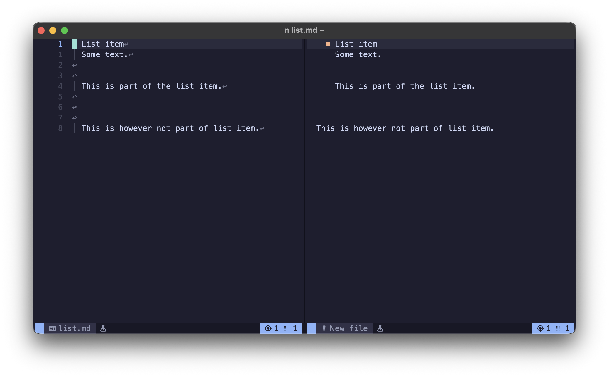

<!--markdoc
    {
        "generic": {
            "filename": "../doc/markview.nvim-experimental.txt",
            "force_write": true,
            "header": {
                "desc": "🧩 Experimental options for `markview.nvim`",
                "tag": "markview.nvim-experimental"
            }
        },
        "markdown": {
            "heading_ratio": [ 26, 54 ],
            "list_items": {
                "marker_minus": "◆",
                "marker_plus": "◇"
            },
            "tags": {
                "date_formats": [ "markview.nvim-experimental.date_formats" ],
                "date_time_formats": [ "markview.nvim-experimental.date_time_formats" ],
                "prefer_nvim": [ "markview.nvim-experimental.prefer_nvim" ],
                "file_open_command": [ "markview.nvim-experimental.file_open_command" ],
                "list_empty_line_tolerance": [ "markview.nvim-experimental.list_empty_line_tolerance" ],
                "read_chunk_size": [ "markview.nvim-experimental.read_chunk_size" ],
                "linewise_ignore_org_indent": [ "markview.nvim-experimental.linewise_ignore_org_indent" ]
            }
        }
    }
-->
<!--markdoc_ignore_start-->
# 🧩 Experimental options
<!--markdoc_ignore_end-->

```lua from: ../lua/markview/types/experimental.lua class: markview.config.experimental
--- Experimental options.
---@class markview.config.experimental
---
---@field date_formats string[] List of lua patterns for detecting date in YAML.
---@field date_time_formats string[] List of lua patterns for detecting date & time in YAML.
---
---@field prefer_nvim boolean Opens text file inside Neovim.
---@field file_open_command string Command used to open files inside Neovim.
---
---@field list_empty_line_tolerance integer Maximum number of empty lines that can stay between text of a list item.
---
---@field read_chunk_size integer Number of `bytes` to check before opening a link. Used for detecting when to open files inside Neovim.
---
---@field linewise_ignore_org_indent? boolean Prevents indentation of sections from being cleared in `linewise_hybrid_mode`.
```

## date_formats

A list of date string formats(used for detecting YAML properties).

```lua
date_formats = {
    "^%d%d%d%d%-%d%d%-%d%d$",      --- YYYY-MM-DD
    "^%d%d%-%d%d%-%d%d%d%d$",      --- DD-MM-YYYY, MM-DD-YYYY
    "^%d%d%-%d%d%-%d%d$",          --- DD-MM-YY, MM-DD-YY, YY-MM-DD

    "^%d%d%d%d%/%d%d%/%d%d$",      --- YYYY/MM/DD
    "^%d%d%/%d%d%/%d%d%d%d$",      --- DD/MM/YYYY, MM/DD/YYYY

    "^%d%d%d%d%.%d%d%.%d%d$",      --- YYYY.MM.DD
    "^%d%d%.%d%d%.%d%d%d%d$",      --- DD.MM.YYYY, MM.DD.YYYY

    "^%d%d %a+ %d%d%d%d$",         --- DD Month YYYY
    "^%a+ %d%d %d%d%d%d$",         --- Month DD, YYYY
    "^%d%d%d%d %a+ %d%d$",         --- YYYY Month DD

    "^%a+%, %a+ %d%d%, %d%d%d%d$", --- Day, Month DD, YYYY
},
```

## date_time_formats

A list of date & time string formats(used for detecting YAML properties).

```lua
date_formats = {
    "^%a%a%a %a%a%a %d%d %d%d%:%d%d%:%d%d ... %d%d%d%d$", --- UNIX date time
    "^%d%d%d%d%-%d%d%-%d%dT%d%d%:%d%d%:%d%dZ$",           --- ISO 8601
},
```

## prefer_nvim

When `true`, opens **text files** inside of Neovim using [experimental.file_open_command](https://github.com/OXY2DEV/markview.nvim/wiki/Experimental#file_open_command).

`prefer_nvim = true`

https://github.com/user-attachments/assets/054a2a1e-56b3-480d-925c-5522b5dc793a

`prefer_nvim = false`

https://github.com/user-attachments/assets/619092da-06f3-40ba-a1ed-5d64ac54bbb8

------

```lua
prefer_nvim = false,
```

## file_open_command

The command used to open new files inside Neovim. [experimental.prefer_nvim](https://github.com/OXY2DEV/markview.nvim/wiki/Experimental#prefer_nvim) must be enabled to use this.

```lua
file_open_command = "tabnew",
```

## list_empty_line_tolerance



Number of repeating empty lines needed to terminate a list item. Any non empty lines after them will not be considered part of the list item.

```lua
list_empty_line_tolerance = 3,
```

## read_chunk_size

Number of **bytes** to read from a file to check if it's a `text file`.[experimental.prefer_nvim](https://github.com/OXY2DEV/markview.nvim/wiki/Experimental#prefer_nvim) must be enabled to use this.

```lua
read_chunk_size = 1024,
```

## linewise_ignore_org_indent

>[!CAUTION]
> **Deprecated**.
> I couldn't find use for this option and thus this was deprecated.

Prevents section indentations to be removed when using [markdown.headings.org_indent]().

```lua
linewise_ignore_org_indent = false
```

