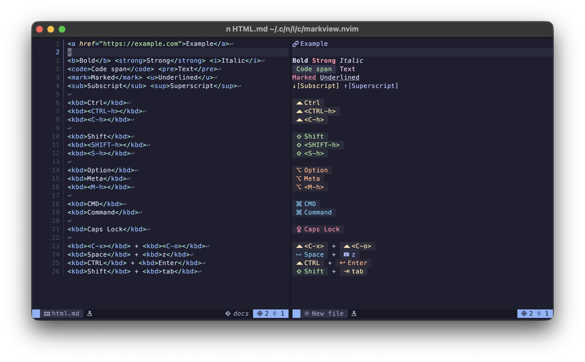
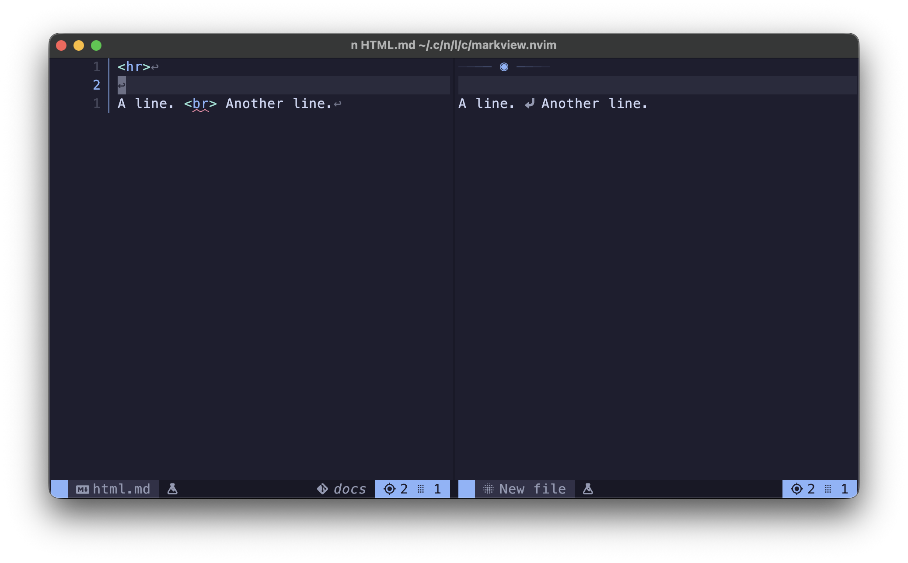

<!--markdoc
    {
        "generic": {
            "filename": "../doc/markview.nvim-html.txt",
            "force_write": true,
            "header": {
                "desc": "🧩 HTML options for `markview`",
                "tag": "markview.nvim-html"
            }
        },
        "markdown": {
            "heading_ratio": [ 20, 60 ],
            "list_items": {
                "marker_minus": "◆",
                "marker_plus": "◇"
            },
            "tags": {
                "enable": [ "markview.nvim-html.enable" ],
                "container_elements": [ "markview.nvim-html.container_elements" ],
                "headings": [ "markview.nvim-html.headings" ],
                "void_elements": [ "markview.nvim-html.void_elements" ]
            }
        }
    }
-->
<!--markdoc_ignore_start-->
# 🧩 HTML
<!--markdoc_ignore_end-->

```lua from: ../lua/markview/types/renderers/html.lua class: markview.config.html
--- Configuration table for HTML preview.
---@class markview.config.html
---
---@field enable boolean Enable **HTML** rendering.
---
---@field container_elements markview.config.html.container_elements Configuration for container elements.
---@field headings markview.config.html.headings Configuration for headings(e.g. `<h1>`).
---@field void_elements markview.config.html.void_elements Configuration for void elements.
```

## enable

```lua
enable = true
```

Enable rendering of HTML elements.

## container_elements

```lua from: ../lua/markview/types/renderers/html.lua class: markview.config.html.container_elements
---@class markview.config.html.container_elements
---
---@field enable boolean Enable rendering of container elements?
---@field [string] markview.config.html.container_elements.opts Configuration for `<string></string>`.
```

Changes how certain container elements look.



```lua
container_elements = {
    enable = true,

    ["^a$"] = {
        on_opening_tag = { conceal = "", virt_text_pos = "inline", virt_text = { { " ", "MarkviewHyperlink" } } },
        on_node = { hl_group = "MarkviewHyperlink" },
        on_closing_tag = { conceal = "" },
    },
    ["^b$"] = {
        on_opening_tag = { conceal = "" },
        on_node = { hl_group = "Bold" },
        on_closing_tag = { conceal = "" },
    },
    ["^code$"] = {
        on_opening_tag = { conceal = "", hl_mode = "combine", virt_text_pos = "inline", virt_text = { { " ", "MarkviewInlineCode" } } },
        on_node = { hl_group = "MarkviewInlineCode" },
        on_closing_tag = { conceal = "", hl_mode = "combine", virt_text_pos = "inline", virt_text = { { " ", "MarkviewInlineCode" } } },
    },
    ["^em$"] = {
        on_opening_tag = { conceal = "" },
        on_node = { hl_group = "@text.emphasis" },
        on_closing_tag = { conceal = "" },
    },
    ["^i$"] = {
        on_opening_tag = { conceal = "" },
        on_node = { hl_group = "Italic" },
        on_closing_tag = { conceal = "" },
    },
    ["^kbd$"] = function (_, item)
        local hl = "MarkviewInlineCode";
        local output = {
            on_opening_tag = { conceal = "" },
            on_node = {
                virt_text_pos = "inline",
                right_gravity = true,
                hl_group = hl
            },
            on_closing_tag = { conceal = "", hl_mode = "combine", virt_text_pos = "inline", virt_text = { { " ", hl } } },
        };

        if not item then
            return output;
        end

        ---@type integer Start column of the node.
        local start_col = item.range.col_start;

        ---@type integer[] Output of `TSNode:range()` on the opening tag.
        local open_range = item.opening_tag.range;
        ---@type integer[] Output of `TSNode:range()` on the closing tag.
        local close_range = item.closing_tag.range;

        ---@type string Normalized keymap.
        local key = string.upper(
            string.sub(
                item.text[1],
                (open_range[4] + 1) - start_col,
                close_range[2] - start_col
            )
        );

        if string.match(key, "^%<C") or string.match(key, "CTRL") then
            hl = "MarkviewPalette3";

            output.on_node.hl_group = hl;
            output.on_node.virt_text = { { "  ", hl } };
            output.on_closing_tag.virt_text = { { " ", hl } };
        elseif string.match(key, "^%<S") or string.match(key, "SHIFT") then
            hl = "MarkviewPalette4";

            output.on_node.hl_group = hl;
            output.on_node.virt_text = { { " 󰘶 ", hl } };
            output.on_closing_tag.virt_text = { { " ", hl } };
        elseif
            string.match(key, "^%<M") or
            string.match(key, "OPT") or string.match(key, "OPTION") or
            string.match(key, "ALT") or string.match(key, "META")
        then
            hl = "MarkviewPalette2";

            output.on_node.hl_group = hl;
            output.on_node.virt_text = { { " 󰘵 ", hl } };
            output.on_closing_tag.virt_text = { { " ", hl } };
        elseif string.match(key, "CMD") or string.match(key, "COMMAND") then
            hl = "MarkviewPalette5";

            output.on_node.hl_group = hl;
            output.on_node.virt_text = { { " 󰘳 ", hl } };
            output.on_closing_tag.virt_text = { { " ", hl } };
        elseif string.match(key, "CAPS.LOCK") then
            hl = "MarkviewPalette1";

            output.on_node.hl_group = hl;
            output.on_node.virt_text = { { " 󰘲 ", hl } };
            output.on_closing_tag.virt_text = { { " ", hl } };
        elseif string.match(key, "SPACE") then
            hl = "MarkviewPalette5";

            output.on_node.hl_group = hl;
            output.on_node.virt_text = { { " 󱁐 ", hl } };
            output.on_closing_tag.virt_text = { { " ", hl } };
        elseif string.match(key, "ENTER") then
            hl = "MarkviewPalette2";

            output.on_node.hl_group = hl;
            output.on_node.virt_text = { { " 󰌑 ", hl } };
            output.on_closing_tag.virt_text = { { " ", hl } };
        elseif string.match(key, "TAB") then
            hl = "MarkviewPalette3";

            output.on_node.hl_group = hl;
            output.on_node.virt_text = { { " 󰌒 ", hl } };
            output.on_closing_tag.virt_text = { { " ", hl } };
        else
            hl = "MarkviewPalette6";

            output.on_node.hl_group = hl;
            output.on_node.virt_text = { { " 󰌌 ", hl } };
            output.on_closing_tag.virt_text = { { " ", hl } };
        end

        return output;
    end,
    ["^mark$"] = {
        on_opening_tag = { conceal = "" },
        on_node = { hl_group = "MarkviewPalette1" },
        on_closing_tag = { conceal = "" },
    },
    ["^pre$"] = {
        on_opening_tag = { conceal = "" },
        on_node = { hl_group = "Special" },
        on_closing_tag = { conceal = "" },
    },
    ["^strong$"] = {
        on_opening_tag = { conceal = "" },
        on_node = { hl_group = "@text.strong" },
        on_closing_tag = { conceal = "" },
    },
    ["^sub$"] = {
        on_opening_tag = { conceal = "", hl_mode = "combine", virt_text_pos = "inline", virt_text = { { "↓[", "MarkviewSubscript" } } },
        on_node = { hl_group = "MarkviewSubscript" },
        on_closing_tag = { conceal = "", hl_mode = "combine", virt_text_pos = "inline", virt_text = { { "]", "MarkviewSubscript" } } },
    },
    ["^sup$"] = {
        on_opening_tag = { conceal = "", hl_mode = "combine", virt_text_pos = "inline", virt_text = { { "↑[", "MarkviewSuperscript" } } },
        on_node = { hl_group = "MarkviewSuperscript" },
        on_closing_tag = { conceal = "", hl_mode = "combine", virt_text_pos = "inline", virt_text = { { "]", "MarkviewSuperscript" } } },
    },
    ["^s$"] = {
        on_opening_tag = { conceal = "" },
        on_node = { hl_group = "@markup.strikethrough" },
        on_closing_tag = { conceal = "" },
    },
    ["^strike$"] = {
        on_opening_tag = { conceal = "" },
        on_node = { hl_group = "@markup.strikethrough" },
        on_closing_tag = { conceal = "" },
    },
    ["^del$"] = {
        on_opening_tag = { conceal = "" },
        on_node = { hl_group = "@markup.strikethrough" },
        on_closing_tag = { conceal = "" },
    },
    ["^u$"] = {
        on_opening_tag = { conceal = "" },
        on_node = { hl_group = "Underlined" },
        on_closing_tag = { conceal = "" },
    },
},
```

Each entry has the following structure,

```lua from: ../lua/markview/types/renderers/html.lua class: markview.config.html.container_elements.opts
--- Configuration table for each container element type.
---@class markview.config.html.container_elements.opts
---
---@field closing_tag_offset? fun(range: integer[]): integer[] Modifies the closing `</tag>`'s range.
---@field node_offset? fun(range: integer[]): integer[] Modifies the element's range.
---@field opening_tag_offset? fun(range: integer[]): integer[] Modifies the opening `<tag>`'s range.
---
---@field on_closing_tag? table | fun(tag: table): table Extmark configuration to use on the closing `</tag>`.
---@field on_node? table Extmark configuration to use on the element.
---@field on_opening_tag? table Extmark configuration to use on the opening `<tag>`.
```

## headings

```lua from: ../lua/markview/types/renderers/html.lua class: markview.config.html.headings
--- HTML heading config.
---@class markview.config.html.headings
---
---@field enable boolean Enable rendering of heading tags.
---@field [string] table Configuration for `<h[n]></h[n]>`.
```

Changes how heading elements look. The configuration is directly passed to `nvim_buf_set_extmark()`.


>[!NOTE]
> By default, the background colors are *very subtle*(this is to prevent messing with the syntax highlighting).
> You can change the highlight groups through your Colorscheme or through `:hi`.

```lua
headings = {
    enable = true,

    heading_1 = {
        hl_group = "MarkviewPalette1Bg"
    },
    heading_2 = {
        hl_group = "MarkviewPalette2Bg"
    },
    heading_3 = {
        hl_group = "MarkviewPalette3Bg"
    },
    heading_4 = {
        hl_group = "MarkviewPalette4Bg"
    },
    heading_5 = {
        hl_group = "MarkviewPalette5Bg"
    },
    heading_6 = {
        hl_group = "MarkviewPalette6Bg"
    },
},
```

## void_elements

```lua from: ../lua/markview/types/renderers/html.lua class: markview.config.html.container_elements
---@class markview.config.html.container_elements
---
---@field enable boolean Enable rendering of container elements?
---@field [string] markview.config.html.container_elements.opts Configuration for `<string></string>`.
```

Changes how certain void elements look.



```lua
void_elements = {
    enable = true,

    ["^hr$"] = {
        on_node = {
            conceal = "",

            virt_text_pos = "inline",
            virt_text = {
                { "─", "MarkviewGradient2" },
                { "─", "MarkviewGradient3" },
                { "─", "MarkviewGradient4" },
                { "─", "MarkviewGradient5" },
                { " ◉ ", "MarkviewGradient9" },
                { "─", "MarkviewGradient5" },
                { "─", "MarkviewGradient4" },
                { "─", "MarkviewGradient3" },
                { "─", "MarkviewGradient2" },
            }
        }
    },
    ["^br$"] = {
        on_node = {
            conceal = "",

            virt_text_pos = "inline",
            virt_text = {
                { "󱞦", "Comment" },
            }
        }
    },
}
```

Each entry has the following structure,

```lua from: ../lua/markview/types/renderers/html.lua class: markview.config.html.void_elements.opts
--- Configuration table for a each void element type.
---@class markview.config.html.void_elements.opts
---
---@field node_offset? fun(range: integer[]): table Modifies the element's range.
---@field on_node table | fun(tag: markview.config.html.void_elements): table Extmark configuration to use on the element.
```

