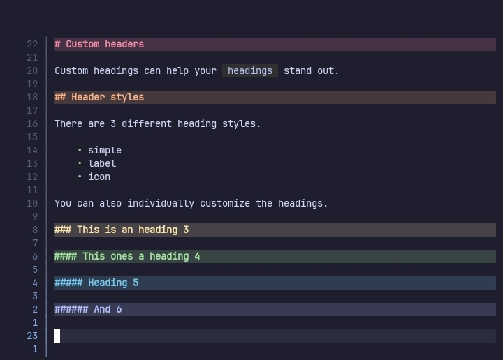
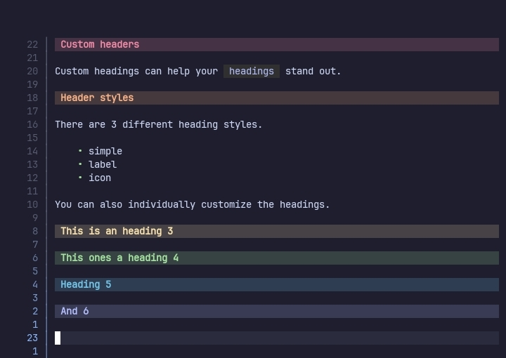

# Headings





## Configuration options

The `headings` option comes with these sub-options.

```lua
headings = {
    enable = true,
    shift_width = vim.o.shiftwidth,

    -- These are just for showing how various
    -- styles can be used for the headings
    heading_1 = {
        style = "simple",
        hl = "col_1"
    },
    heading_2 = {
        style = "label",
        hl = "col_2",

        corner_left = " ",
        padding_left = nil,

        icon = "⑄ ",

        padding_right = " ",
        padding_right_hl = "col_2_fg",

        corner_right = "█▓▒░",

        sign = "▶ ",
        sign_hl = "col_2_fg"
    },
    heading_3 = {
        style = "icon",
        hl = "col_3",

        shift_char = "─",
        icon = "┤ ",

        text = "Heading lvl. 3",

        sign = "▷ ",
        sign_hl = "col_2_fg"
    },

    --- Similar tables for the other headings
    heading_4 = {...},
    heading_5 = {...},
    heading_6 = {...},


    -- For headings made with = or -
    setext_1 = {
        style = "simple",
        hl = "col_1"
    },
    setext_2 = {
        style = "github",

        hl = "col_2",
        icon = " 🔗  ",
        line = "─"
    }
}
```

## Global options

The `headings` option has the following options for controlling all the headings.

> enable
> `boolean or nil`

When set to `false`, headings are not rendered.

> shift_width
> `number or nil`

The number of spaces to add **per level** of a heading. When nil `vim.o.shiftwidth` is used.

## Styles

The plugin can be used to configure each of the headings individually.

There are 2 types of headings that are supported by the plugin.

- `atx_headings`
  Made using `#` before the text.

- `setext_headings`
  Made using a border of either `=` or `-`.

### Styles for normal headings

There are 6 sub-options for styling different heading levels. These are,

- heading_1
- heading_2
- heading_3
- heading_4
- heading_5
- heading_6

They can have different **styles** which affects what sub-option(s) you can use.

#### All the sub-options

> style
> `string`

The name of the style to use. Currently it supports 3 styles.

- simple,
  For adding simple background colors.

- label,
  For making headings look like labels(like in glow).

- icon,
  Adds icons & signs(optionally) to the headings.

> hl
> `string or nil`

The default highlight group for all the highlight group related options.

The sub-option(s) that use this is a fallback has a `*` after the sub-option name.

> shift_char
> `string or nil`

The character used for shifting the headings by their level. It is repeated by the amount specified in `shift_width`.

---

<details><!-- -+ Title: "Statusline-like parts for headings"-->

<summary>Statusline-like parts for building headings</summary>

How the following sub-options are applied is given below.

```txt
█▒ ▶ Heading▒█
││└┬┘└──┬──┘│└─ corner_right
││ │    │   └── padding_right
││ │    └────── text
││ └─────────── icon
│└───────────── padding_left
└────────────── corner_left

```

> corner_left
> `string or nil`
>
> For `label` style only.

The string to use as the left corner of **labels**.

> corner_left_hl*
> `string or nil`
>
> For `label` style only.

Name of the highlight group to use for `corner_left`.

> padding_left
> `string or nil`
>
> For `label` style only.

The string to use as the left padding of **labels**.

> padding_left_hl*
> `string or nil`
>
> For `label` style only.

Name of the highlight group to use for `padding_left`.


> icon
> `string or nil`
>
> For `icon` & `label` styles only.

The string to use as the icon for the heading.

> icon_hl*
> `string or nil`
>
> For `icon` & `label` styles only.

Name of the highlight group to use for `icon`.

> text
> `string or nil`
>
> For `icon` & `label` styles only.

The string to use as the title for the heading. When nil the actual title is used.

> text_hl*
> `string or nil`
>
> For `icon` & `label` styles only.

Name of the highlight group to use for `text`.


> padding_right
> `string or nil`
>
> For `label` style only.

The string to use as the right padding of **labels**.

> padding_right_hl*
> `string or nil`
>
> For `label` style only.

Name of the highlight group to use for `padding_right`.

> corner_right
> `string or nil`
>
> For `label` style only.

The string to use as the right corner of **labels**.

> corner_right_hl*
> `string or nil`
>
> For `label` style only.

Name of the highlight group to use for `corner_right`.

</details><!-- -_ -->

---

> sign
> `string or nil`
>
> For `icon` & `label` styles only.

The string to use as the sign of the heading.

> sign_hl*
> `string or nil`
>
> For `icon` & `label` styles only.

Name of the highlight group to use for `sign`.

#### Sub-options for various styles

> Simple

- hl

> label

- hl

- sign
- sign_hl

- corner_left
- corner_left_hl
- padding_left
- padding_left_hl
- icon
- icon_hl
- text
- text_hl
- padding_right
- padding_right_hl
- corner_right
- corner_right_hl

> icon

- hl

- sign
- sign_hl

- icon
- icon_hl
- text
- text_hl

### Styles for setext headings

There are only 2 sub-options for setext headings. These are,

- setext_1
- setext_2

They can have different **styles** which affects what sub-option(s) you can use.

#### All the sub-options

> style
> `string`

The name of the style to use. Currently it supports 2 styles.

- simple
  Adds a background color to the heading.

- github
  Adds heading icons & underlines to the heading(like in github).

> hl
> `string or nil`

The default highlight group for all the highlight group related options.

The sub-option(s) that use this is a fallback has a `*` after the sub-option name.

---

> icon
> `string or nil`
>
> For `github` style only.

The text to use as the icon for the heading.

> icon_hl*
> `string or nil`
>
> For `github` style only.

Highlight group for the `icon`.

> line
> `string or nil`
>
> For `github` style only.

Character for making the border.

> line_hl*
> `string or nil`
>
> For `github` style only.

Highlight group for `line`.

#### Sub-options for various styles

> Simple

- hl

> github

- hl

- icon
- icon_hl

- line
- line_hl

## Examples

### Simple label style headings

Start by setting some `highlight groups` for the heading.

```lua
highlight_groups = {
    {
        group_name = "H1",
        value = { bg = "#f38ba8", fg = "#1E1E2E" }
    },
    {
        group_name = "H1_corners",
        value = { bg = "#f38ba8" }
    },
}
```

Now, we set the `shift_width` to 0 so that the headings stay at the start of the line.

After that we can set the `corner_left` & `corner_right` to " " and use the `H1_corners` as the value for `corner_left_hl` & `corner_right_hl`. The will give a simple corner to the headings.

To color the rest of the heading we simply use the `hl` option and set it to `H1`.

```lua
headings = {
    shift_width = 0,

    heading_1 = {
        style = "label",

        corner_left = " ",
        corner_left_hl = "H1_corners",
        corner_right = " ",
        corner_right_hl = "H1_corners",

        hl = "H1"
    },
}
```

### Decorated headings

You can also make decorated headings using the `label` style.

You can use `powerline symbols` to make corners of the headings.

```lua
headings = {
    shift_width = 0,

    heading_1 = {
        style = "label",

        corner_left = " ",
        corner_left_hl = "H1_corners",

        padding_right = " ",
        padding_right_hl = "H1_corners",

        corner_right = "",
        corner_right_hl = "H1",

        hl = "H1"
    },
}
```

### Headings with icons

By using the `icon` style you can add icons to the headings.

```lua
headings = {
    heading_1 = {
        style = "icon",

        icon = "▶ ",
        hl = "H1"
    },
}
```

You can also use this option for adding `heading numbers`.

```lua
headings = {
    heading_1 = {
        style = "icon",

        icon = "󰼏  ",
        hl = "H1"
    },
}
```

## Gallery

Wow, so empty 😐


