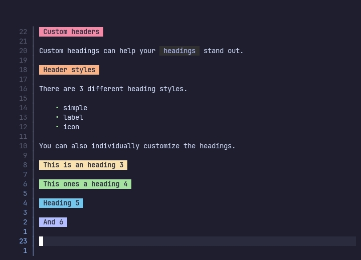
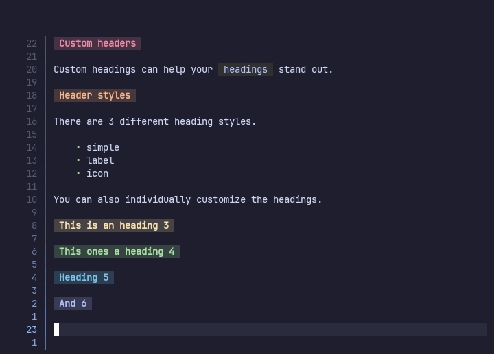
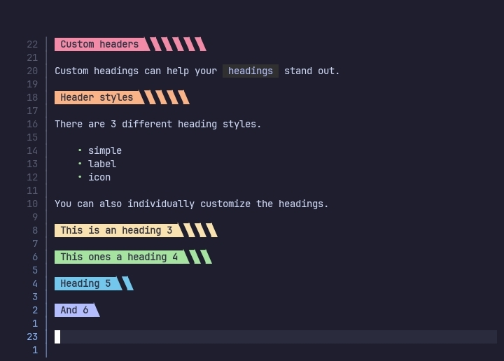
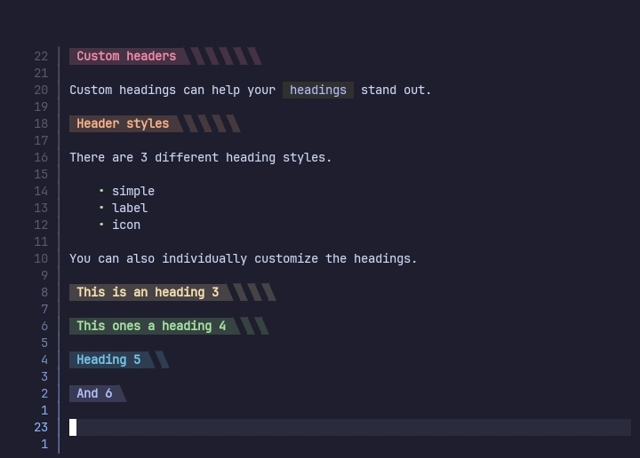

# Headings

This plugin provides custom headings whuch can be configured through this option.







>[!IMPORTANT]
> Do not use `italics`, `bold` texts or `inline codes` in your headings.
>
> The plugin will render the text with the symbols as they are not yet supported.

## Configuration

Configuration for the `heading` is separated into 2 parts, `global` & `level specific`.

### Global configuration

Global configuration options are used to change how all the headings behave.

```lua
heading = {
    enable = true,
    shift_width = 4,

    heading_1 = {},
    heading_2 = {},
    heading_3 = {},
    heading_4 = {},
    heading_5 = {},
    heading_6 = {}
}
```

#### enable

A boolean value, used to enable or disable custom headings.

#### shift_width

A number value, the number of times `shift_char` will be repeated.

When nil, `vim.o.shiftwidth` is used.

#### headings

Configuration table for various `level specific` options.

### Level specific configuration

Each heading level has the following configuration table. They can be used to customise individual headings.

```lua
heading_1 = {
    style = "label",

    hl = "rainbow1",

    corner_left = "", corner_left_hl = nil,
    corner_right = "", corner_right_hl = nil,

    padding_left = "", padding_left_hl = nil,
    padding_right = "", padding_right_hl = nil,

    icon = "", icon_hl = nil,
    text = "", text_hl = nil,

    sign = nil, sign_hl = nil
}
```

#### style

A string value, the style of the heading. Currently supported values are.

- simple, Simple line highlighting
- label, Custom labels that can be configured like statusline components.
- icon, Icons for the heading text

>[!IMPORTANT]
> The properties given below will behave differently based on the used `style`.

#### hl

The default value all the `highlight` properties(properties whose name ends with `hl`).

#### corner_left

Used by the `label` style.

The left corner for the heading.

#### corner_left_hl

Used by the `label` style.

Highlight group for the left corner. When nil the value of `hl` is used.

#### corner_right

Used by the `label` style.

The right corner for the heading.

#### corner_right_hl

Used by the `label` style.

Highlight group for the right corner. When nil the value of `hl` is used.

#### padding_left

Used by the `label` style.

The left padding for the heading. Added after the `left_corner`.

#### padding_left_hl

Used by the `label` style.

Highlight group for the left padding. When nil the value of `hl` is used.

#### padding_right

Used by the `label` style.

The right padding for the heading. Added before the `right_corner`.

#### padding_right_hl

Used by the `label` style.

Highlight group for the right padding. When nil the value of `hl` is used.

#### icon

Used by the `label` & `icon` style.

A custom icon for the heading. It is added after the padding for headings with the `label` style.

There won't be any spaces added between the icon & the heading's text. So, you should add the spaces to the icon itself.

#### icon_hl

Used by the `label` & `icon` style.

Highlight group for the icon. When nil the value of `hl` is used.

#### text

Used by the `label` & `icon` style.

A custom text for the heading. This will replace the heading's title.

#### text_hl

Used by the `label` & `icon` style.

Highlight group for the headings text. When nil the value of `hl` is used.

#### sign

Used by the `label` & `icon` style.

A custom sign for the heading.

#### sign_hl

Used by the `label` & `icon` style.

Highlight group for the sign. When nil the value of `hl` is used.
