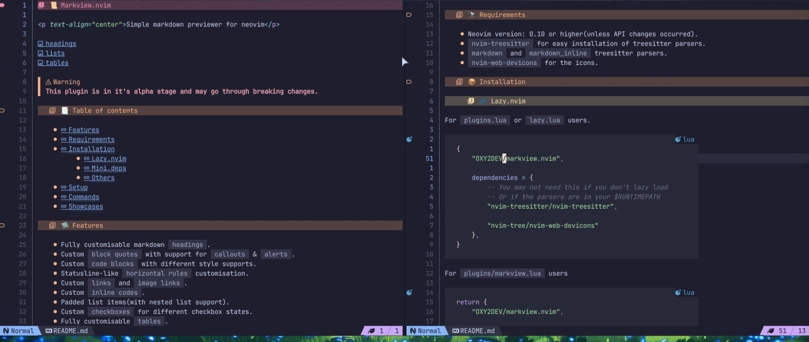
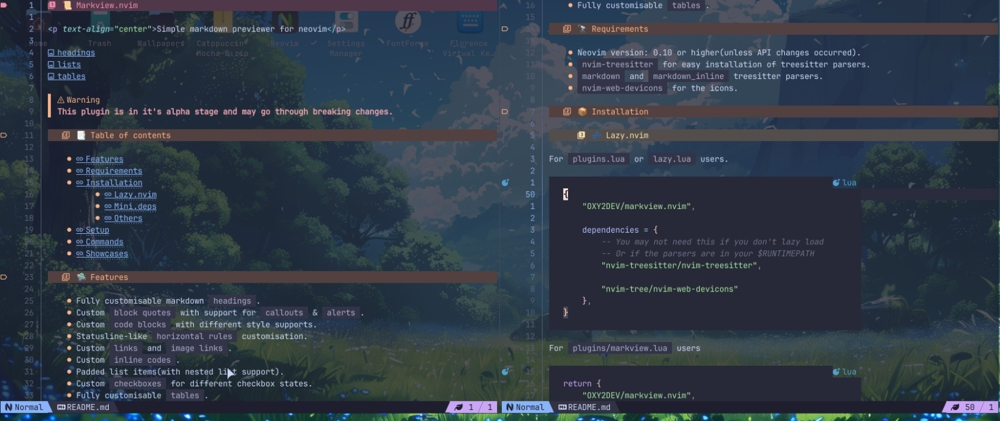

# 📜 markview.nvim

An experimental `markdown` previewer for Neovim.

>[!NOTE]
> If you have screenshots of the plugin that you want to be shown in the repo then you can submit them in the special pinned issue.

## Table of contents

- [Getting started](<./Getting started.md>)
- [Plugin setup](<./Plugin setup.md>)
- [Block quotes](<./Block quotes.md>)
- [Check boxes](./Checkboxes.md)
- [Code blocks](<./Code blocks.md>)
- [Headings](./Headings.md)
- [Horizontal rules](<./Horizontal rules.md>)
- [Inline codes](<./Inline codes.md>)
- [Links](./Links.md)
- [List Items](<./List items.md>)
- [Tables](./Tables.md)

The wiki is going through a revision so many things may be outdated

## Known issues

- `Concealments` not working properly on scroll
  
  This is not caused by the plugin and can be fixed by simply disabling `spell` for markdown files.

## Q&A

#### The plugin isn't loading/crashing, what do I do?

First off, RTFM(basically read the README). You should check the `requirements` section and see if you have everything.

You Neovim version should be at least `0.10`. You also need `nvim-treesitter`(for easy installation of parsers) and have the parsers installed in your `$RUNTIMEPATH`.

For the parsers, you need `markdown` and `markdown_inline` parsers for the plugin to work.

>[!IMPORTANT]
> If you are using a `distro`(e.g. LazyVim) then you should first check what options they set(from their `wiki`). Some of them can negatively impact the plugin.

>[!WARNING]
> DO NOT GO OVERBOARD WITH LAZY LOADING.
>
> It's meant to prevent unused things from loading when Neovim starts(which this plugin does NOT). So, lazy loading wouldn't make much of a difference. However, it can sometimes cause the plugin to not load.

#### Why don't the background colors work when Neovim is transparent?

By default, the plugin looks into the background color of `Normal` or the foreground color of `Cursor` as a fallback. This value is used to blend the foreground color of specific hughlight groups. The resulting color is used as the background color.

Some colorschemes don't set the values for these colors(sometimes as a mistake or to achieve transparency). So, the plugin can't use them. In that case no color is returned. This leads to some highlight groups not having any background colors.

#### Why are some items colored incorrectly?

>[!NOTE]
> You need a `Tree-sitter` supported colorscheme to get the correct colors.

For creating the highlight groups `markview` will use some of the default highlight groups for markdown. These are set by `Tree-sitter` and require a supported colorscheme to work.

If the highlight groups are not found then the plugin will use the default values(taken from `catppuccin-mocha's` color palette).

## Gallery

> Wow, so empty 😐

