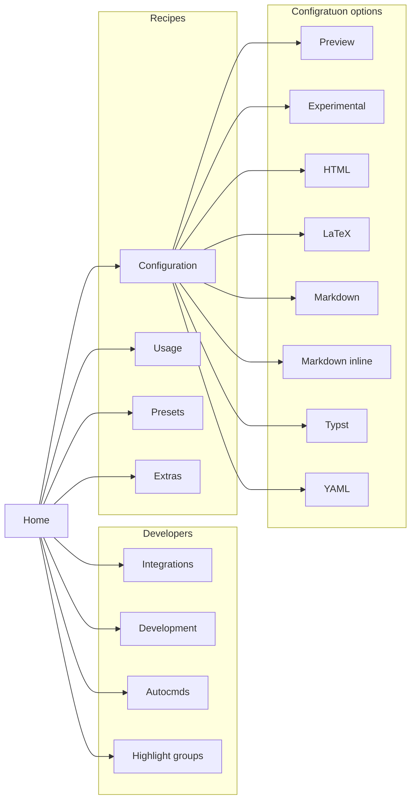

# ☄️ markview.nvim

<div align="center">
    
</div>

<p align="center">
   A hackable <b>Markdown</b>, <b>HTML</b>, <b>LaTeX</b>, <b>Typst</b> & <b>YAML</b> previewer for Neovim.
</p>



- [📞 Autocmds](https://github.com/OXY2DEV/markview.nvim/wiki/Autocmds)
- [🔩Configuration](https://github.com/OXY2DEV/markview.nvim/wiki/Configuration)
    - [🧩 Experimental](https://github.com/OXY2DEV/markview.nvim/wiki/Experimental)
    - [🧩 HTML](https://github.com/OXY2DEV/markview.nvim/wiki/HTML)
    - [🧩 LaTeX](https://github.com/OXY2DEV/markview.nvim/wiki/LaTeX)
    - [🧩 Markdown](https://github.com/OXY2DEV/markview.nvim/wiki/Markdown)
    - [🧩 Markdown inline](https://github.com/OXY2DEV/markview.nvim/wiki/Markview-inline)
    - [🧩 Preview](https://github.com/OXY2DEV/markview.nvim/wiki/Preview)
    - [💻 Renderers](https://github.com/OXY2DEV/markview.nvim/wiki/Renderers)
    - [🧩 Typst](https://github.com/OXY2DEV/markview.nvim/wiki/Typst)
    - [🧩 YAML](https://github.com/OXY2DEV/markview.nvim/wiki/YAML)
- [💻 Development](https://github.com/OXY2DEV/markview.nvim/wiki/Development)
- [📦 Extras](https://github.com/OXY2DEV/markview.nvim/wiki/Extras)
- [🎨 Highlight groups](https://github.com/OXY2DEV/markview.nvim/wiki/Highlight-groups)
- [🎇 Integrations](https://github.com/OXY2DEV/markview.nvim/wiki/Integrations)
- [💡 Presets](https://github.com/OXY2DEV/markview.nvim/wiki/Presets)
- [🪄 Usage](https://github.com/OXY2DEV/markview.nvim/wiki/Usage)

------

>[!TIP]
> You can `toggle` the preview using a keymap!
> ```lua
> vim.api.nvim_set_keymap("n", "<leader>m", "<CMD>Markview<CR>", { desc = "Toggle `markview` globally" });
> ```

