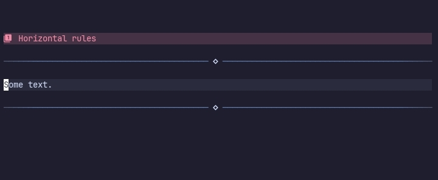

# Horizontal rules



This plugin provides custom `horizontal_rules` that you can customise using the `horizontal_rules` option.

```lua
horizontal_rules = {
    enable = true,

    position = "inline",
    parts = {}
}
```

## enable

When false, custom Horizontal rules are disabled.

## position

Changes the `virt_text_pos` of the custom horizontal rules.

By default it will use `overlay` virtual text.


## parts

Statusline-like parts for the horizontal rules.

Currently available parts are.

- text
- repeating

### text

Shows a predefined text in the horizontal rule.

```lua
horizontal_rules = {
    parts = {
        {
            type = "text",

            text = " □ ",
            hl = "rainbow6"
        }
    }
}
```

#### type

A string value to identify what part a table is.

#### text

The text to show in the horizontal rules.

#### hl

Highlight group for `text`.


### repeating

Repeats the predefined text.

```lua
horizontal_rules = {
    parts = {
        {
            type = "repeating",

            text = "─",
            repeat_amount = function ()
                return vim.o.columns;
            end,

            hl = "rainbow6",
            direction = "left"
        }
    }
}
```

#### type

A string value to identify what part a table is.

#### text

The text to repeat.

#### repeat_amount

When the value is a number, the text is repeated by that amount.

When it's a function, the returned value is used.

#### hl

When the value is a string, it is applied to the entire virt_text_pos

When it's a list, the character's index is used for the highlight group. This creates a gradient.

#### direction

Changes the direction of where `hl` is applied from.

>[!NOTE]
> This means from where in the `output text` they are applied from.

Possible values are.

- left(default), hl is applied from the left.
- right, hl is applied from the right

