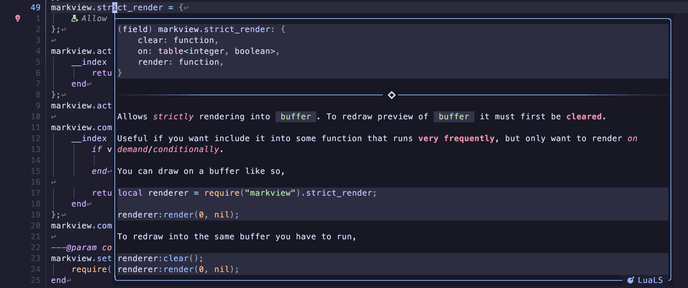

<!--markdoc
    {
        "generic": {
            "filename": "../doc/markview.nvim-integrations.txt",
            "force_write": true,
            "header": {
                "desc": "🎇 Integrations for `markview.nvim`",
                "tag": "markview.nvim-integrations"
            }
        },
        "markdown": {
            "heading_ratio": [ 26, 54 ],
            "list_items": {
                "marker_minus": "◆",
                "marker_plus": "◇"
            },
            "tags": {
                "blink.cmp": [ "markview.nvim-integrations.blink-cmp" ],
                "gx$": [ "markview.nvim-integrations.gx" ],
                "colorschemes$": [ "markview.nvim-integrations.transparent_colorschemes" ],
                "nvim-cmp": [ "markview.nvim-integrations.nvim-cmp" ]
            }
        }
    }
-->
<!--markdoc_ignore_start-->
# 🎇 Integrations
<!--markdoc_ignore_end-->

`markview.nvim` provides integrations with the following plugins. You find these in [markview/integrations.lua](https://github.com/OXY2DEV/markview.nvim/wiki/Integrations).

## 📦 blink.cmp

Completion for Checkbox states & Callouts are provided.

You can disable this by running the following *before* loading `markview`.

```lua
vim.g.markview_blink_loaded = true;
```

## 📦 gx

https://github.com/user-attachments/assets/2b8de549-e429-4be5-ba3a-f7f9a12ce5f2

Modified `gx` mapping that can,

- Go to heading based on Github-flavored/Gitlab-flavored links(e.g. `#-integrations` for `🎇 Integrations`).
- Open files inside Neovim using some command(e.g. `:tabnew`). Requires [experimental.prefer_nvim](https://github.com/OXY2DEV/markview.nvim/wiki/Experimental#prefer_nvim) to `true`.

## 📦 Transparent colorschemes

Markview provides dynamic highlight groups for colorschemes. However, this may not look right when using `transparent` colorschemes.

You can change what color is used for blending by setting these variables,

- `vim.g.markview_light_bg`, used when `background` is `"light"`(default).
- `vim.g.markview_dark_bg`, used when `background` is `"dark"`.

>[!IMPORTANT]
> These values will not be used if `Normal` highlight group has a background color.

## 📦 nvim-cmp

Completion for Checkbox states & Callouts are provided.

You can disable this by running the following *before* loading `markview`.

```lua
vim.g.markview_cmp_loaded = true;
```

## 📦 LSP hovers



You can use `markview.nvim` to *prettify* the LSP hover window.

You can see an example [here](https://gist.github.com/OXY2DEV/645c90df32095a8a397735d0be646452).

