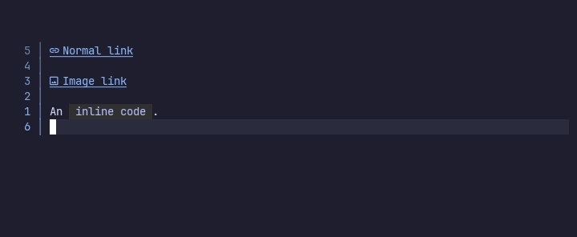

# links



## Configuration options

The `links` option comes with these sub-options.

```lua
links = {
    enable = true,

    inline_links = {},
    images = {},
    emails = {}
}
```

### Global options

The `links` option has the following options for controlling various link types.

> enable
> `boolean or nil`

When set to `false`, links are not rendered.

### Link specific options

For customising links there are 3 sub-options.

> inline_links
> `table or nil`

Used for customising normal links.

> images
> `table or nil`

Used for customising image links.

> emails
> `table or nil`

Used for customising email links.

### Link customisation options

Each link type has the following sub-options for customisation.

```lua
inline_links = {
    hl = nil,

    corner_left = "", corner_left_hl = nil,
    padding_left = "", padding_left_hl = nil,

    icon = "", icon_hl = nil,

    padding_right = "", padding_right_hl = nil,
    corner_right = "", corner_right_hl = nil
}
```

How the following sub-options are applied is given below.

```txt
█▒  Link  ▒█
││└┬┘└──┬─┘│└─ corner_right
││ │    │  └── padding_right
││ │    └───── text [Not an option]
││ └────────── icon
│└──────────── padding_left
└───────────── corner_left

```

> corner_left
> `string or nil`
>
> For `label` style only.

The string to use as the left corner of **links**.

> corner_left_hl*
> `string or nil`
>
> For `label` style only.

Name of the highlight group to use for `corner_left`.

> padding_left
> `string or nil`
>
> For `label` style only.

The string to use as the left padding of **links**.

> padding_left_hl*
> `string or nil`
>
> For `label` style only.

Name of the highlight group to use for `padding_left`.


> icon
> `string or nil`
>
> For `icon` & `label` styles only.

The string to use as the icon for the link.

> icon_hl*
> `string or nil`
>
> For `icon` & `label` styles only.

Name of the highlight group to use for `icon`.


> padding_right
> `string or nil`
>
> For `label` style only.

The string to use as the right padding of **links**.

> padding_right_hl*
> `string or nil`
>
> For `label` style only.

Name of the highlight group to use for `padding_right`.

> corner_right
> `string or nil`
>
> For `label` style only.

The string to use as the right corner of **links**.

> corner_right_hl*
> `string or nil`
>
> For `label` style only.

Name of the highlight group to use for `corner_right`.

## Gallery

Wow, so empty 😐

