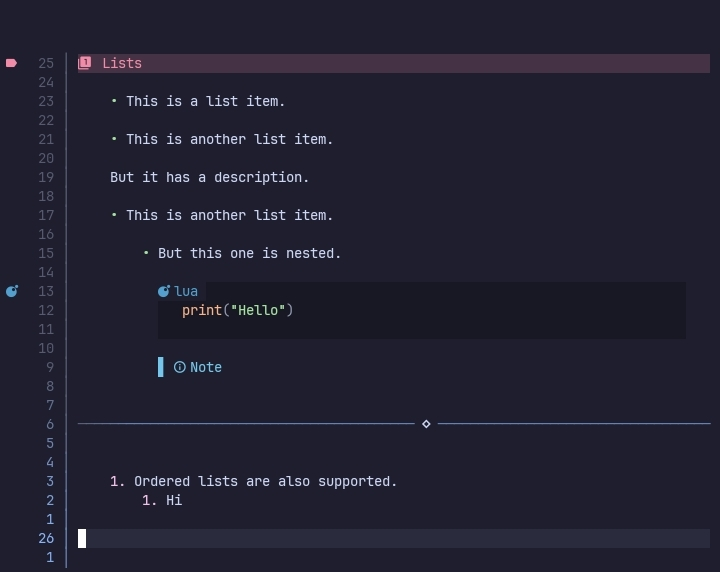

# Lists



This plugin provides custom `list items` which can be configured via the `list_items` option.

```lua
list_items = {
    enable = true,
    shift_amount = 4,

    marker_plus = {},
    marker_minus = {},
    marler_star = {},

    marker_dot = {}
}
```

## enable

Enable/Disable custom list items.

## shift_amount

The number of spaces to add before the item per level.

## marker_plus, marker_minus, marker_star, marker_dot

These options allow the customisation of various list types.

- marker_plus, lists that use `+` as the marker.
- marker_minus, lists that use `-` as the marker.
- marker_star, lists that use `*` as the marker.
- marker_dot, Numbered lists.

All of them have the following configuration table.

```lua
marker_plus = {
    add_padding = true,
    
    text = "•",
    hl = "rainbow5"
}
```

### add_padding

When true, adds padding before the items equal to the level multiplied by the `shift_amount`.

### text

Custom marker for the list item, replaces the marker text.

### hl

Highlight group for `text`.


