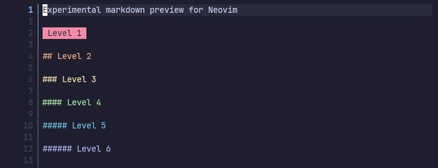
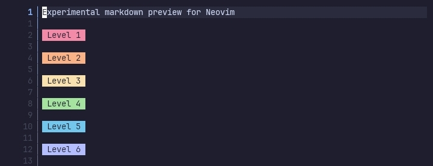
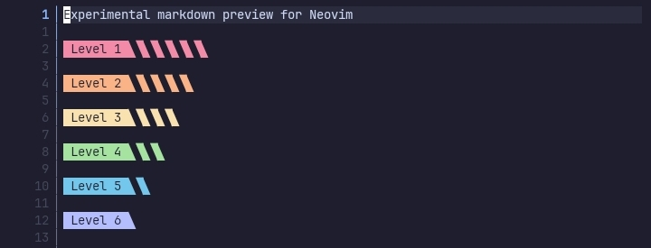
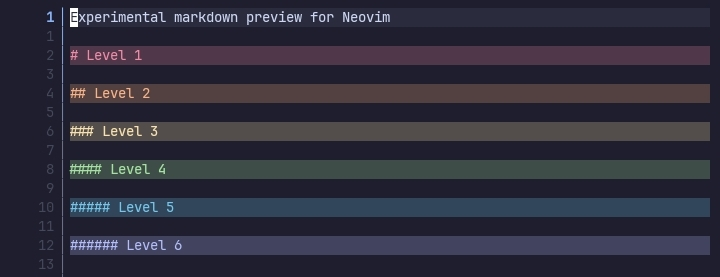
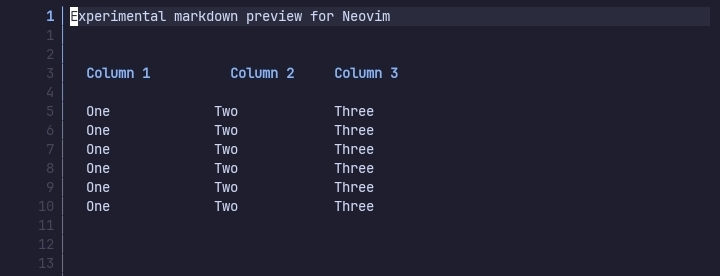
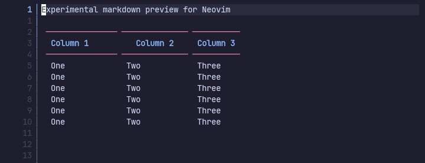
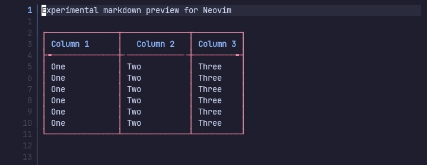
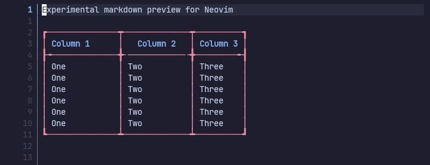
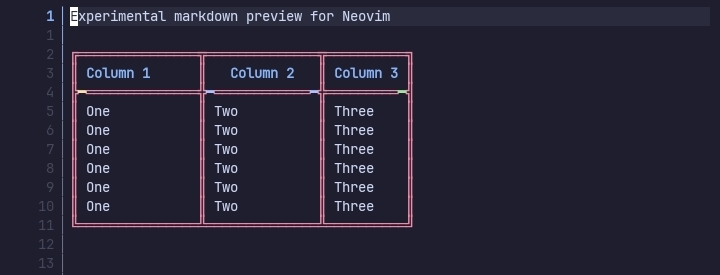

# Presets

Presets are `configuration tables` that you can use to quickly customise various parts of the plugin.

They can be used by requiring the presets file and using the values in the `setup()` function.

Example usage,

```lua
local presets = require("markview.presets");

require("markview").setup({
    headings = presets.headings.glow
});
```

## Table of contents

- [Heading presets](#_heading_presets)
- [Table presets](#_table_presets)

## Heading presets

The plugin provides quite a few presets for headings such as,

### glow



Adds `Glow-like` headings to the previewer.

### glow_labels



Unlike **glow** this one will also add decorations to all heading levels.

### decorated_labels



Adds decorations to the headings.

### simple



Adds simple background color to the headings.

### simple_no_marker


Like **simple** but removes the leading `#` of headings.

## Table presets

There are a few presets for various borders of tables such as,

### border_none



Replaces table borders with `whitespaces`.

### border_headers



Only adds border to the `table_headers`

### border_single



Like the `border="single"` of floating windows. Doesn't use rounded corners.

### border_single_corners



Makes the border corners thicker to stand out more.

### border_double



Like the `border="double"` of floating windows.

