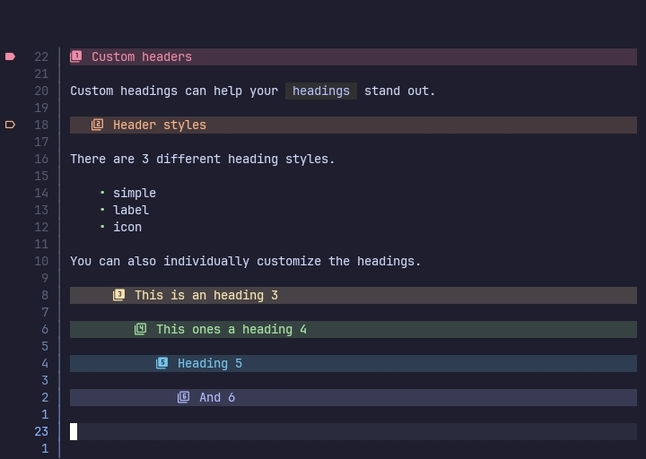
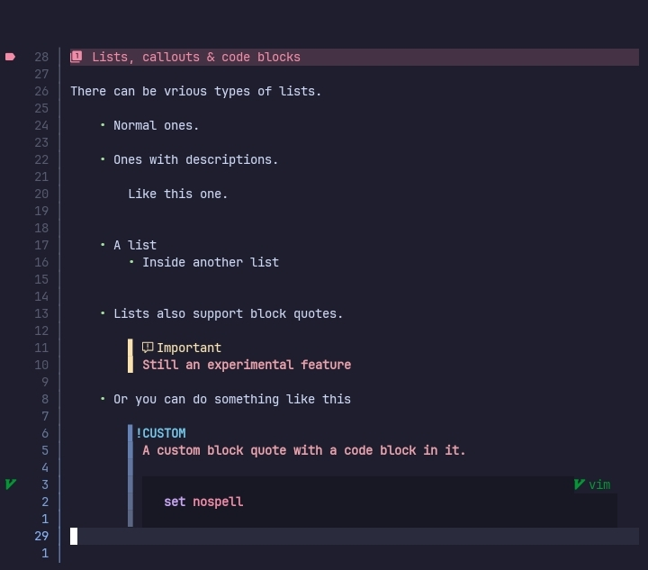
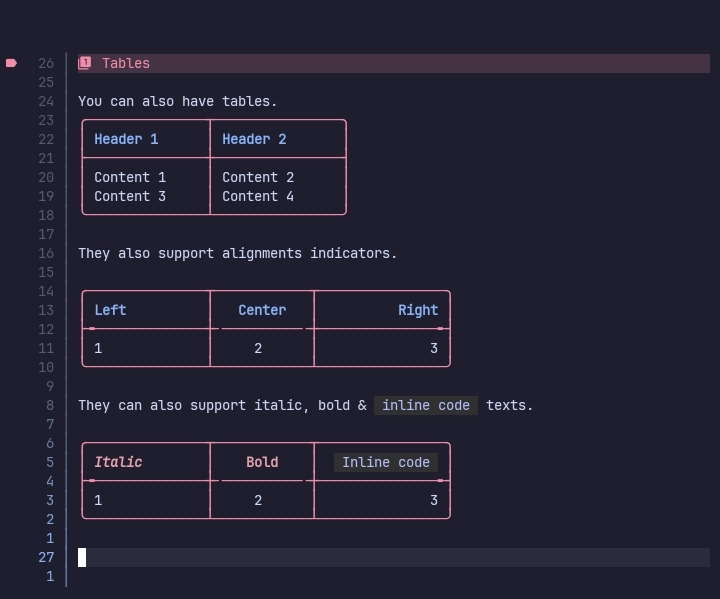

# 📜 Markview.nvim

<p text-align="center">Simple markdown previewer for neovim</p>





>[!WARNING]
> This plugin is in it's alpha stage and may go through breaking changes.

## 📑 Table of contents

- [Features](#-features)
- [Requirements](#-requirements)
- [Installation](#-installation)
  - [Lazy.nvim](#-lazynvim)
  - [Mini.deps](#-minideps)
  - [Others](#-others)
- [Setup](#-setup)
- [Commands](#-commands)
- [Showcases](#-showcases)

## 🛸 Features

- Fully customisable markdown `headings`.
- Custom `block quotes` with support for `callouts` & `alerts`.
- Custom `code blocks` with different style supports.
- Statusline-like `horizontal rules` customisation.
- Custom `links` and `image links`.
- Custom `inline codes`.
- Padded list items(with nested list support).
- Custom `checkboxes` for different checkbox states.
- Fully customisable `tables`.

## 🔭 Requirements

- Neovim version: 0.10 or higher(unless API changes occurred).
- `nvim-treesitter` for easy installation of treesitter parsers.
- `markdown` and `markdown_inline` treesitter parsers.
- `nvim-web-devicons` for the icons.

## 📦 Installation

### 💤 Lazy.nvim

For `plugins.lua` or `lazy.lua` users.

```lua
{
    "OXY2DEV/markview.nvim",

    dependencies = {
        -- You may not need this if you don't lazy load
        -- Or if the parsers are in your $RUNTIMEPATH
        "nvim-treesitter/nvim-treesitter",

        "nvim-tree/nvim-web-devicons"
    },
}
```

For `plugins/markview.lua` users

```lua
return {
    "OXY2DEV/markview.nvim",

    dependencies = {
        -- You may not need this if you don't lazy load
        -- Or if the parsers are in your $RUNTIMEPATH
        "nvim-treesitter/nvim-treesitter",

        "nvim-tree/nvim-web-devicons"
    },
}
```

### 🦠 Mini.deps

```lua
local MiniDeps = require("mini.deps");

MiniDeps.add({
    source = "OXY2DEV/markview.nvim",

    depends = {
        -- You may not need this if you don't lazy load
        -- Or if the parsers are in your $RUNTIMEPATH
        "nvim-treesitter/nvim-treesitter",

        "nvim-tree/nvim-web-devicons"
    }
})
```

### 🤔 Others

The installation process for any other plugin manager(s) is the same.

If your plugin manager doesn't support `dependencies` then you can always load the plugins in the right order.

```vim
Plug "nvim-treesitter/nvim-treesitter"
Plug "nvim-tree/nvim-web-devicons"

Plug "OXY2DEV/markview.nvim"
```

## 🧭 Setup

>[!NOTE]
> This plugin does not use `setup()` to initialize. So, it is completely optional to call it.

Configuration table for the `setup()` function is given below.

```lua
require("markview").setup({
    buf_ignore = { "nofile" },
    modes = { "n" },

    -- Returns the conceallevel to the global value when changing modes
    restore_conceallevel = true,
    -- Returns the concealcursor to the global value when changing modes
    restore_concealcursor = false,

    headings = {},
    code_blocks = {},
    block_quotes = {},
    horizontal_rules = {},
    hyperlinks = {},
    images = {},
    inline_codes = {},
    list_items = {},
    list_items = {},
    checkboxes = {},
    tables = {}
});
```

 For customisation related options check the [wiki pages](https://github.com/OXY2DEV/markview.nvim/wiki).

## 🎹 Commands

>[!NOTE]
> Commands are a test feature.

There is only a single command for now, `:Markview`.

When called without any arguments, it toggles the plugin.

Possible subcommands are,

- `toggleAll`, toggles the plugin
- `enableAll`, enables the preview in all the attached buffers
- `disableAll`, disables the preview in all the attached buffers


## 👾 Showcases

>[!IMPORTANT]
> Screenshots on a phone are very blurry(Yes, the plugin was made on my phone).
>
> If you have screenshots of the plugin, you can submit them in the special issue(not yet open). And yes, credit will be provided.

