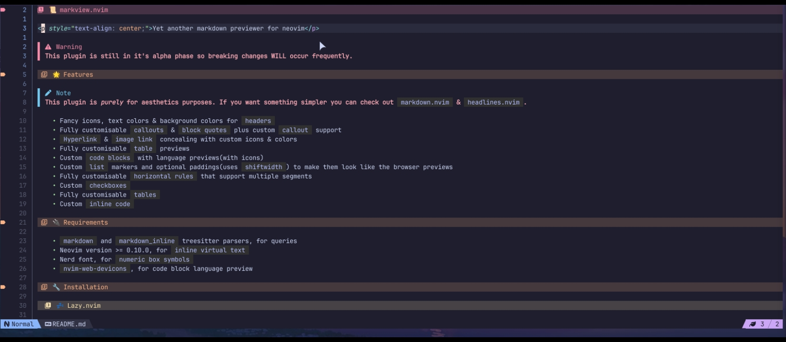

# 📜 markview.nvim

<p style="text-align: center;">Yet another markdown previewer for neovim</p>




>[!WARNING]
> This plugin is still in it's **alpha phase** so breaking changes **WILL** occur frequently.

## 🌟 Features

>[!NOTE]
> This plugin was created mainly for `personal use` and is *purely* for aesthetics purposes. If you want something simpler you can check out `markdown.nvim` & `headlines.nvim`.

- Fancy icons, text colors & background colors for `headers`
- Fully customisable `callouts` & `block quotes` plus custom `callout` support
- `Hyperlink` & `image link` concealing with custom icons & colors
- Fully customisable `table` previews
- Custom `code blocks` with language previews(with icons)
- Custom `list` markers and optional paddings(uses `shiftwidth`) to make them look like the browser previews
- Fully customisable `horizontal rules` that support multiple segments
- Custom `checkboxes`
- Fully customisable `tables`
- Custom `inline code`

## 🔌 Requirements

- `markdown` and `markdown_inline` treesitter parsers, for queries
- Neovim version >= 0.10.0, for `inline virtual text`
- Nerd font, for `numeric box symbols`
- `nvim-web-devicons`, for code block language preview

## 🔧 Installation

### 💤 Lazy.nvim

```lua
-- For plugin.lua users
{
    "OXY2DEV/markview.nvim",
    dependencies = {
        "nvim-tree/nvim-web-devicons", -- Used by the code bloxks
    },

    config = function ()
        require("markview").setup();
    end
}

-- For plugins/markview.lua users
return {
    "OXY2DEV/markview.nvim",
    dependencies = {
        "nvim-tree/nvim-web-devicons", -- Used by the code bloxks
    },

    config = function ()
        require("markview").setup();
    end
}
```

### 🦠 mini.deps

```lua
require("mini.deps").add({
    source = "OXY2DEV/markview.nvim",
    depends = {
        "nvim-tree/nvim-web-devicons", -- Used by the code bloxks
    }
})
```

## ⌨️ Setup

Use the `setup()` function to set the various options.

```lua
require("markview").setup({
    highlight_groups = {},


    header = {},

    code_block = {},
    inline_code = {},

    block_quote = {},

    horizontal_rule = {},

    hyperlink = {},
    image = {},

    table = {},

    list_item = {},
    checkbox = {}
})
```

All the options have `individual configuration tables`. As such, they are explained in their own sections.


## 🧭 Customisation

>[!IMPORTANT]
> The main focus of the plugin is **aesthetics** and as such the configuration table can look quite **big** & **complicated**.
>
> It is recommended that you store the configuration tables in `variables` and use them for the `setup()` function.
>
> Here's a simple example,
>
> ```lua
> local header_conf = {}; -- configuration for the markdown headers
> 
> require("markview").setup({
>   header = header_conf
> });
> ```

### 🎨 Highlight groups

Used to set up highlight_groups for the plugin.

When set to `false`, no highlight group is set.

It can also be used to set your own highlight groups.

```lua
require("markview").setup({
    highlight_groups = {
        {
	    	group_name = "markview_h1",
		    value = { bg = "#453244", fg = "#f38ba8" }
        }
    }
})
```

The items in it should have 2 properties,
- `group_name`, highlight group name
- `value`, the value to set for that highlight group(see `{val}` in `nvim_set_hl()`)

>[!NOTE]
> The list is NOT merged with the default highlight groups.

### 🔖 Header

Configuration table for the `markdown headers`.

It is a list containing tables that have the following options.

```lua
header = {
    {
        style = "padded_icon",

        line_hl = "markview_h1",

        -- This uses nerd font symbol by default and is therefore not shown here
        sign = "", sign_hl = "rainbow1",

        -- This uses nerd font symbol by default and is therefore not shown here
        icon = "", icon_hl = "markview_h1_icon",
        icon_width = 1
    }
}
```

The index of a table in the list is used to determine what is used for a specific header. So, for the `6th header` the 6th item in the list is used.

If the list has **less than 6** items then the internal `tbl_clamp()` function is used to find the last table.

Here's what all of the options do.

- `style`, Changes how the headers are shown
- `line_hl`, Sets the highlight group for coloring the line itself
- `sign`, Optional symbol for the sign column 
- `sign_hl`, Sets the highlight group for the `sign`
- `icon`, The icon used for the header
- `icon_hl`, The highlight group for the icon

>[!NOTE]
> Some of these options are only available for specific `style`.

The available `styles` and what they do are given below,

- simple

  Adds a background color to the line. Optionally supports signs.
  
  It supports the following options,
  
  - `sign` & `sign_hl`

    For showing a sign for the header in the `sign_column` and coloring the sign.

  - `line_hl`

    For changing the background color of the header.

- icon

  Adds simple icon for the headers. The icon should be `2 characters` wide.
  
  Along with all the options mentioned in the previous style this one supports these options.

  - `icon` & `icon_hl`

    For adding icons before the `header` text and coloring the icon.

  - `pad_char` & `pad_hl`
 
    Allows changing the `character` used for the padding and it's `color`.
    Paddings are used to hide the `#` and correctly align the icons.

- padded_icon

  Like `icon` but adds padding to the icon and allows more control over how they are shown.
  
  Along with all the options mentioned in the previous styles this one supports the following option.

  - `icon_width`
  
    Changes where the icon is positioned. By default, the `icon's` character width is used. But can be changed to something else if you need.

>[!TIP]
> If you are using the `padded_icon` style then you can use the `icon_width` property to change how many spaces are added before the icon.
>
> The number of spaces added before the icon is calculated with the following equation.
>
> ```txt
> position_x = position_of_the_header + header_level - icon_width;
> ```

### 💻 Code block

Configuration table for `code blocks` in markdown.

```lua
code_block = {
    style = "language",
    block_hl = "code_block",

    pad_char = " ",
    language_hl = "Bold",
}
```

Here's what all of them do
- `style`, Changes how code blocks are shown
- `block_hl`, Used to change the background of the block
- `pad_char`, Character used as padding
- `language_hl`, Highlight group for the code blocks language

>[!NOTE]
> Some of these options are only available for specific `style`.

The available `styles` and what they do are given below

- simple
    
  Only adds the background and hides the top & bottom texts

  This style has the following options available,

  - `block_hl`

- padded

  Adds padding on the left side of the code.

  Along with the options from the previous style it also supports,

  - `pad_char`

- language

  Shows the language's file icon and name(the one in the code block) and adds padding.

  Along with the options from the previous style it also supports,

  - `language_hl`

### Inline code block

>[!NOTE]
> This plugin changes how `inline codes` are concealed.

Configuration table for the `inline codes` in markdown.

```lua
inline_code = {
    before = " ", after = " ",
    
    hl = "inline_code_blocks"
}
```

Here's what all the options do,

- `before`, the text to add before the item. Preferably a single character
- `after`, like `before` but added after the item
- `hl`, used to color the entire item along with `before` & `after`

### 📌 Block quotes

Configuration table for `callouts` and `block quotes`.

```lua
bloxk_quote = {
    default = {
        border = "▌", border_hl = { "Glow_1", "Glow_2", "Glow_3", "Glow_4", "Glow_5", "Glow_6" }
    },

    callouts = {
        {
            match_string = "[!NOTE]",

            callout_preview = "Note",
            callout_preview_hl = "rainbow5",

            border = "▌", border_hl = "rainbow5"
        }
    }
}
```

Here's what all the options do,

- `default`, used to configure normal `block quotes`
- `callouts`, a list of configuration table for various `callouts`. Each table has the following options

  - `match_string`, the string used to match the callout
  - `callout_preview`, the text to show for the callout
  - `callout_preview_hl`, highlight group for `callout_preview`
  - `border`, string used as the border for the callout
  - `border_hl`, highlight group for `border`

### 📏 Horizonal rule

Configuration table for the `horizontal rules`

```lua
horizontal_rule = {
    style = "simple",
    border_char = "─",
    border_hl = "Comment",

    segments = {},
    segments_hl = {}
}
```

Here's what all the options do,

- `style`, allows you to switch between using a character(s) or 3 segments for the horizontal rule
- `border_char`, character(s) used to make the border, Preferably a single character 
- `border_hl`, highlight group for `border_char` or `segments`
- `segments`, allows setting up left border character, right border character and a middle section for the line, only the 2nd item of the list isn't repeated.
- `segments_hl`, highlight group for the `segments`, when nil `border_hl` is used

>[!NOTE]
> You can use `segments` and `segments_hl` to create fancy lines too(like in obsidian, though a bit more restrictive).

### 🔗 Hyperlink

Configuration table for the link previews.

```lua
hyperlink = {
    icon = "",
    hl = "Label"
}
```

Here's what all the options do,

- `icon`, text to add before the link text
- `hl`, highlight group for the text and `icon`

### 📹 Image

Configuration table for the images.

```lua
image = {
    icon = "",
    hl = "Label"
}
```

Here's what all the options do,

- `icon`, text to add before the link text
- `hl`, highlight group for the text and `icon`

### 🛸 Table

Configuration table for markdown table.

>[!WARNING]
> Still an experimental feature, expect bugs.

```lua
table = {
    table_chars = {
        "╭", "─", "╮", "┬",
        "├", "│", "┤", "┼",
        "╰", "─", "╯", "┴"
    },
    table_hls = { "rainbow1" },

    use_virt_lines = false
}
```

Here's what all the options do,

- `table_chars`, characters to create the table itself
- `table_hls`, highlight group for the `table_chars`, the item's index is used for selecting the highlight group, the last non-nil value is used if the item is nil
- `use_virt_lines`, will make the plugin use `overlay` virtual text for the top and bottom border, instead of virtual lines, may reduce cursor jumps

### 🧾 List

>[!IMPORTANT]
> The property name is subject to change

Configuration table for the `unordered lists`.

```lua
list_item = {
    marker_plus = {
        add_padding = true,

        marker = "•",
        marker_hl = "rainbow2"
    },
    marker_minus = {},
    marker_star = {},
}
```

Here's what all the options do,

- `marker_plus`, `marker_minus` & `marker_star`
  Sets individual configuration for the various styles of lists

  They have the following sub options,

  - `add_padding`
    Adds a padding(equal to `shiftwidth` if set to nil)

  - `marker`
    Text to use as the marker. Preferably a single character

  - `marker_hl`
    Highlight group for `marker`

### 📝 Checkbox 

Configuration table for `checkboxes`.

```lua
checkbox = {
    checked = {
        marker = " ✔ ", marker_hl = "@markup.list.checked"
    },
    unchecked = {
        marker = " ✔ ", marker_hl = "@markup.list.checked"
    }
}
```

Here's what all the options do,

- `checked` & `unchecked`
  Individual configuration table for the different checkbox states

  They have the following sub options,

    - `marker`, the text to replace the checkbox. Preferably 3 characters
    - `marker_hl`, highlight group for `marker`


---
