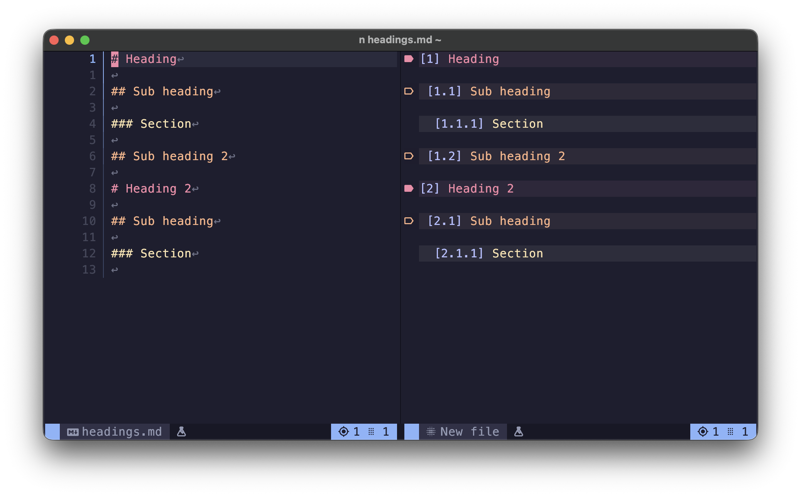

<!--markdoc
    {
        "generic": {
            "filename": "../doc/markview.nvim-usage.txt",
            "force_write": true,
            "header": {
                "desc": "🪄 Usage examples for `markview.nvim`",
                "tag": "markview.nvim-usage"
            }
        },
        "markdown": {
            "heading_ratio": [ 50, 30 ],
            "link_url_modifiers": [
                [ "#headings", "|markview.nvim-markdown.headings|" ]
            ],
            "list_items": {
                "marker_minus": "◆",
                "marker_plus": "◇"
            }
        }
    }
-->
<!--markdoc_ignore_start-->
# 🪄 Usage
<!--markdoc_ignore_end-->

Various usage recipes for `markview.nvim`.

## 🎹 Toggling preview

Only show previews *on demand*.

```lua
-- Disable automatic previews.
require("markview").setup({
    preview = { enable = false }
});

vim.api.nvim_set_keymap("n", "<leader>m", "<CMD>Markview<CR>", { desc = "Toggles `markview` previews globally." });
```

## 🎹 Toggling hybrid mode

Toggle `Hybrid mode` if you use it in `insert mode`.

```lua
vim.api.nvim_set_keymap("i", "<Ctrl-m>", "<CMD>Markview HybridToggle<CR>", { desc = "Toggles `hybrid mode` globally." });
```

## 🎹 Switch between `line-wise` & `node-wise` hybrid mode

```lua
vim.api.nvim_set_keymap("n", "<leader>s", "<CMD>Markview linewiseToggle<CR>", { desc = "Toggles `line-wise` hybrid mode." });
```

## 🎹 Toggled splitview

Toggle current buffer in splitview.

```lua
vim.api.nvim_set_keymap("n", "<leader>s", "<CMD>Markview splitToggle<CR>", { desc = "Toggles `splitview` for current buffer." });
```

------

This is a collection of `configs` that,

+ Implement new features.
+ Extends existing features.
+ Requires more than simply calling `setup()`. Or
+ Requires understanding of how the plugin works.

## 📂 Header folding

<!-- Header fold image -->

>[!IMPORTANT]
> By default, `treesitter` folds *a lot* of things other than headings. This modifies the folding behavior.

1. Go to `~/.config/nvim/queries/markdown/`.

>[!NOTE]
> If you have a different `config` path you can get the path with,
> 
> ```vim
> :=vim.fn.stdpath("config") .. "/queries/markdown/"
> ```

2. Create a `folds.scm` file with the following content.

```query
; NOTE: `(#trim!)` is used to prevent empty lines at the end of the section from being folded.
((section
    (atx_heading)) @fold
    (#trim! @fold))
```

3. Set `foldmethod`(see `:h 'foldmethod'`) to `v:lua.vim.treesitter.foldexpr()`.

4. Set `foldtext`(see `:h 'foldtext'`) to `""`.

### ✨ Custom header text

Not implemented yet!

## 🎨 Single highlight group for all links

> This has been taken from [#265](https://github.com/OXY2DEV/markview.nvim/issues/265)

```lua
local spec = require("markview.spec");
local config = spec.get({ "markdown_inline", "hyperlinks" }, { fallback = {} });

local function generic_hl (group)
    local output = {};

    for k, v in pairs(config) do
        output[k] = vim.tbl_extend("force", v, { hl = group });
    end

    return output;
end

require("markview").setup({
    markdown = {
       reference_definitions = generic_hl("MarkviewPalette4Fg")
    },
    markdown_inline = {
        hyperlinks = generic_hl("MarkviewHyperlink"),
        uri_autolinks = generic_hl("MarkviewEmail"),
    },

    typst = {
        url_links = generic_hl("MarkviewEmail")
    }
});
```

## 📐 Changing indentation level of list items

> This has been taken from [#283](https://github.com/OXY2DEV/markview.nvim/issues/283)

>[!TIP]
> This works the same way for `Typst` too!

Copy this to your plugin's `config` option.

```lua
require("markview").setup({
    markdown = {
        list_items = {
            shift_width = function (buffer, item)
                ---@type integer Parent list items indent. Must be at least 1.
                local parent_indnet = math.max(1, item.indent - vim.bo[buffer].shiftwidth);
                return (item.indent) * (1 / (parent_indnet * 2));
            end,
            marker_minus = {
                add_padding = function (_, item)
                    return item.indent > 1;
                end
            }
        }
    }
});
```

Equation used to modify indent level,

```
        indent                      1
------------------------- = 1 ÷ --------- = new_indent
indent * (1 / new_indent)       new_indent
```

## ✨ No nerd font

> This has been taken from [#350](https://github.com/OXY2DEV/markview.nvim/issues/350)

Copy this to your `config` option,

```lua
local presets = require("markview.presets");
require("markview").setup(presets.no_nerd_fonts);
```

## 🔳 Toggling table borders

> This has been taken from [#371](https://github.com/OXY2DEV/markview.nvim/issues/371)

Copy this to your `config` option,

>[!TIP]
> You can use `bb` to toggle the border. Or set the **buffer-local** variable `noborder` to disable borders.

```lua
local default = require("markview.spec").default.markdown.tables;
local no_border = require("markview.presets").tables.none;

require("markview").setup({
    markdown = {
        tables = function (buffer)
            if buffer and vim.b[buffer].noborder == true then
                -- We merge the tables to avoid issues due to
                -- options missing in the presets.
                return vim.tbl_deep_extend("force", default, no_border);
            else
                return default;
            end
        end
    }
});

-- Use `bb` to toggle table border.
vim.api.nvim_set_keymap("n", "bb", "", {
    desc = "Switch table [b]order",
    callback = function ()
        if vim.b.noborder == true then
            vim.b.noborder = false;
        else
            vim.b.noborder = true;
        end

        require("markview").commands.Render();
    end
});
```

## ⏱️ Heading numbers

In recent versions(`>=v25.11.0`), you are able to use `%d` in [headings.icon](https://github.com/OXY2DEV/markview.nvim/wiki/Markdown#headings) to show `heading level`.



Example `config`,

```lua
require("markview").setup({
    markdown = {
        headings = {
            heading_1 = { icon_hl = "@markup.link", icon = "[%d] " },
            heading_2 = { icon_hl = "@markup.link", icon = "[%d.%d] " },
            heading_3 = { icon_hl = "@markup.link", icon = "[%d.%d.%d] " }
        }
    }
});

-- **Preset** usage ------------------------------------------------------

local presets = require("markview.presets").headings;

require("markview").setup({
    markdown = { headings = presets.numbered }
});

-- **Advanced** usage ----------------------------------------------------

--- Gets icon from a parsed heading item.
---@param item markview.parsed.markdown.atx
---@return string
local function get_icon (_, item)
    if not item or not item.levels then
        return "";
    end

    local output = "◈ ";

    for l, level in ipairs(item.levels) do
        if level ~= 0 then
            output = output .. level .. (l ~= #item.levels and "." or "");
        end
    end

    return output .. " ";
end

require("markview").setup({
    markdown = {
        headings = {
            heading_1 = { icon_hl = "@markup.link", icon = get_icon },
            heading_2 = { icon_hl = "@markup.link", icon = get_icon },
            heading_3 = { icon_hl = "@markup.link", icon = get_icon }
        }
    }
});
```

